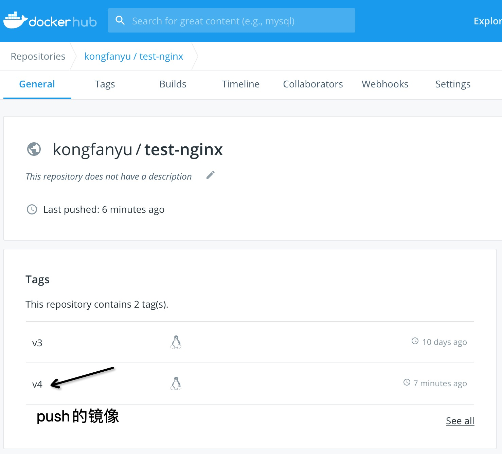
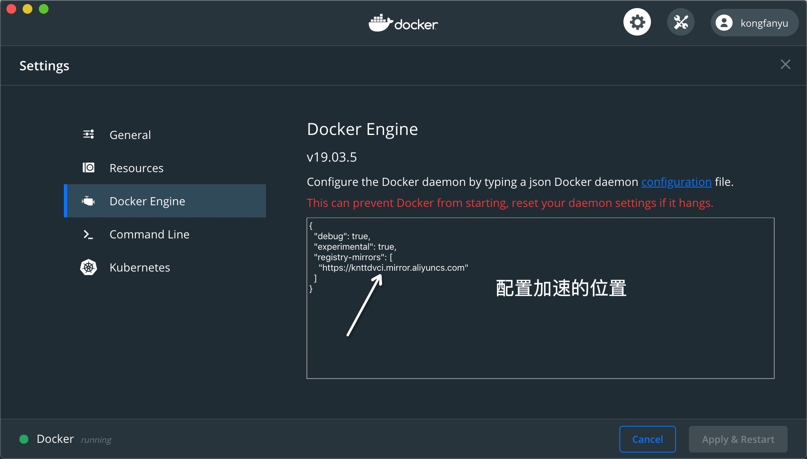
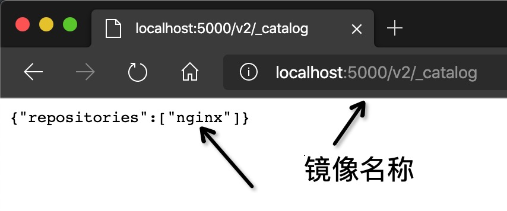
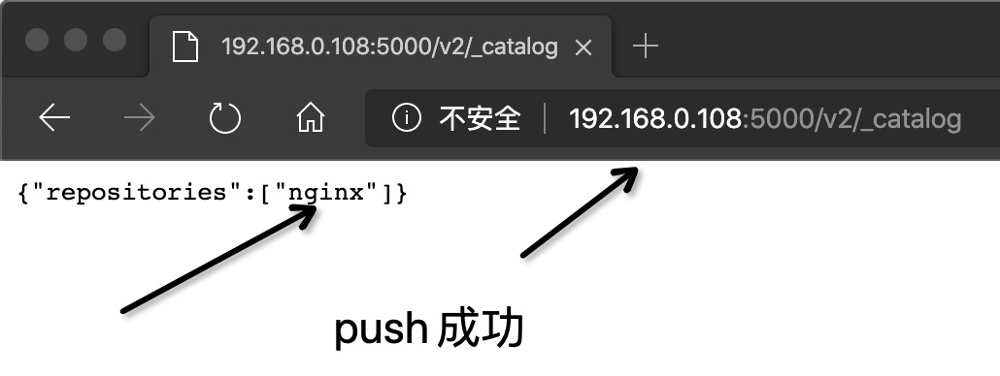
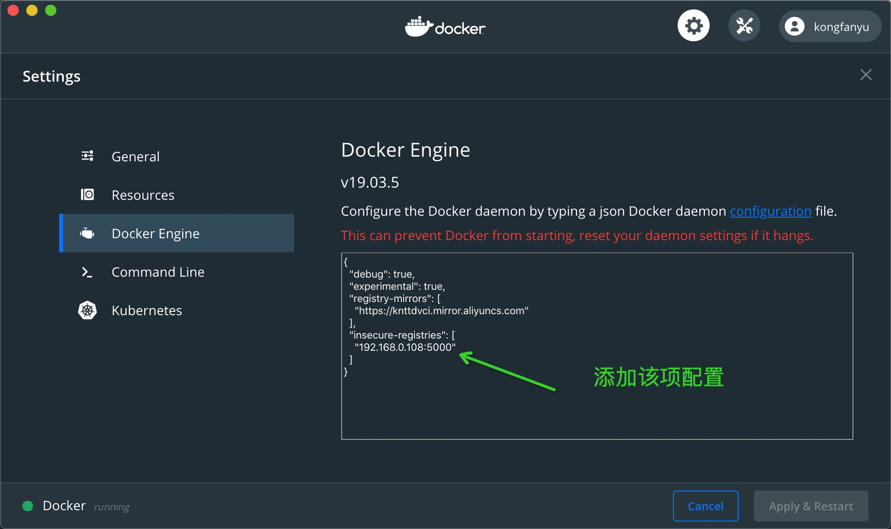

# 5. 私有镜像仓库
这节课给大家讲讲私有镜像仓库的使用。

## Docker Hub
目前 Docker 官方维护了一个公共仓库`Docker Hub`，大部分需求都可以通过在 Docker Hub 中直接下载镜像来实现。如果你觉得拉取 Docker Hub 的镜像比较慢的话，我们可以配置一个镜像加速器：[http://docker-cn.com/](http://docker-cn.com/)，当然国内大部分云厂商都提供了相应的加速器，简单配置即可。

### 注册
你可以在 [https://cloud.docker.com](https://cloud.docker.com) 免费注册一个 Docker 账号。

### 登录
通过执行`docker login`命令交互式的输入用户名及密码来完成在命令行界面登录 Docker Hub。

```shell
$ docker login                               
Login with your Docker ID to push and pull images from Docker Hub. If you don't have a Docker ID, head over to https://hub.docker.com to create one.
Username: kongfanyu
Password: 
Login Succeeded
```


### 注销
你可以通过`docker logout`退出登录。
拉取镜像

### 拉取镜像
你可以通过`docker search`命令来查找官方仓库中的镜像，并利用`docker pull`命令来将它下载到本地。

例如以 centos 为关键词进行搜索：
```shell
$ docker search centos
NAME                                            DESCRIPTION                                     STARS     OFFICIAL   AUTOMATED
centos                                          The official build of CentOS.                   465       [OK]
tianon/centos                                   CentOS 5 and 6, created using rinse instea...   28
blalor/centos                                   Bare-bones base CentOS 6.5 image                6                    [OK]
saltstack/centos-6-minimal                                                                      6                    [OK]
tutum/centos-6.4                                DEPRECATED. Use tutum/centos:6.4 instead. ...   5                    [OK]
```

可以看到返回了很多包含关键字的镜像，其中包括镜像名字、描述、收藏数（表示该镜像的受关注程度）、是否官方创建、是否自动创建。

官方的镜像说明是官方项目组创建和维护的，`automated`资源允许用户验证镜像的来源和内容。

根据是否是官方提供，可将镜像资源分为两类。

* 一种是类似 centos 这样的镜像，被称为基础镜像或根镜像。这些基础镜像由 Docker 公司创建、验证、支持、提供。这样的镜像往往使用单个单词作为名字。
* 还有一种类型，比如 tianon/centos 镜像，它是由 Docker 的用户创建并维护的，往往带有用户名称前缀。可以通过前缀`username/`来指定使用某个用户提供的镜像，比如 tianon 用户。

另外，在查找的时候通过`--filter=stars=N`参数可以指定仅显示收藏数量为 N 以上的镜像。下载官方 centos 镜像到本地。
```shell
$ docker pull centos
Pulling repository centos
0b443ba03958: Download complete
539c0211cd76: Download complete
511136ea3c5a: Download complete
7064731afe90: Download complete
```

### 推送镜像
用户也可以在登录后通过`docker push`命令来将自己的镜像推送到 Docker Hub。以下命令中的 username 请替换为你的 Docker 账号用户名。
```shell
$ docker tag nginx:v3 kongfanyu/test-nginx:v4                                                   
------------------------------------------------------------
$ docker images                                                                                
REPOSITORY             TAG                 IMAGE ID            CREATED             SIZE
nginx                  latest              a1523e859360        7 days ago          127MB
kongfanyu/test-nginx   v4                  a6b925d90917        10 days ago         127MB
registry               2.6.2               10b45af23ff3        5 weeks ago         28.5MB
busybox                latest              6d5fcfe5ff17        2 months ago        1.22MB
------------------------------------------------------------
$ docker push kongfanyu/test-nginx:v4                           
The push refers to repository [docker.io/kongfanyu/test-nginx]
0a0bf6e9f2f9: Layer already exists 
22439467ad99: Layer already exists 
b4a29beac87c: Layer already exists 
488dfecc21b1: Layer already exists 
v4: digest: sha256:44b1d3411096683fc6d2ecf17a83f48a6494573f4fa2ad9ea2a5f0744580c5a0 size: 1155
# 以下是Ubuntu案例
$ docker tag ubuntu:17.10 username/ubuntu:17.10
$ docker image ls

REPOSITORY                                               TAG                    IMAGE ID            CREATED             SIZE
ubuntu                                                   17.10                  275d79972a86        6 days ago          94.6MB
username/ubuntu                                          17.10                  275d79972a86        6 days ago          94.6MB
$ docker push username/ubuntu:17.10
$ docker search username

NAME                      DESCRIPTION                                     STARS               OFFICIAL            AUTOMATED
username/ubuntu
```

查看Docker hub网站，可以看到推送的镜像信息。



## 加速器

1.  docker-cn.com加速器
2.  阿里云加速器
3.  Docker DeskTop配置加速器



## 私有仓库

有时候使用 Docker Hub 这样的公共仓库可能不方便，用户可以创建一个本地仓库供私人使用。

`docker-registry`是官方提供的工具，可以用于构建私有的镜像仓库。本文内容基于 docker-registry v2.x 版本。你可以通过获取官方 registry 镜像来运行。

```shell
$ docker run -d -p 5000:5000 --restart=always --name myregistry registry:2.6.2
```

这将使用官方的`registry`镜像来启动私有仓库。默认情况下，仓库会被创建在容器的`/var/lib/registry`目录下。你可以通过 -v 参数来将镜像文件存放在本地的指定路径。例如下面的例子将上传的镜像放到本地的 /opt/data/registry 目录。否则容器停止之后提交的镜像就被删除了。
```shell
$ docker run -d \
    -p 5000:5000 \
    -v /opt/data/registry:/var/lib/registry \
    registry
```

### 在私有仓库上传、搜索、下载镜像
创建好私有仓库之后，就可以使用`docker tag`来标记一个镜像，然后推送它到仓库。例如私有仓库地址为 127.0.0.1:5000。先在本机查看已有的镜像。
```shell
$ docker image ls
REPOSITORY                        TAG                 IMAGE ID            CREATED             VIRTUAL SIZE
ubuntu                            latest              ba5877dc9bec        6 weeks ago         192.7 MB
```

使用`docker tag`将 ubuntu:latest 这个镜像标记为 127.0.0.1:5000/ubuntu:latest。
格式为 docker tag IMAGE[:TAG] [REGISTRY_HOST[:REGISTRY_PORT]/]REPOSITORY[:TAG]
```shell
$ docker tag nginx:v4 127.0.0.1:5000/nginx:v4
$ docker push 127.0.0.1:5000/nginx:v4                                                                                                               kongfanyu@kongfanyudeMacBook-Pro
The push refers to repository [127.0.0.1:5000/nginx]
318be7aea8fc: Pushed 
fe08d5d042ab: Pushed 
f2cb0ecef392: Pushed 
v4: digest: sha256:4a50ed86d8c86e35f530d4a168173677a192177eed14146fbb5728b1b3a2d4de size: 948
#以下是Ubuntu案例
$ docker tag ubuntu:latest 127.0.0.1:5000/ubuntu:latest
$ docker image ls
REPOSITORY                        TAG                 IMAGE ID            CREATED             VIRTUAL SIZE
ubuntu                            latest              ba5877dc9bec        6 weeks ago         192.7 MB
127.0.0.1:5000/ubuntu:latest      latest              ba5877dc9bec        6 weeks ago         192.7 MB
```

使用`docker push`上传标记的镜像。
```shell
$ docker push 127.0.0.1:5000/ubuntu:latest
The push refers to repository [127.0.0.1:5000/ubuntu]
373a30c24545: Pushed
a9148f5200b0: Pushed
cdd3de0940ab: Pushedfc56279bbb33: Pushed
b38367233d37: Pushed
2aebd096e0e2: Pushed
latest: digest: sha256:fe4277621f10b5026266932ddf760f5a756d2facd505a94d2da12f4f52f71f5a size: 1568
```

用`curl`查看仓库中的镜像。
```shell
$ curl 127.0.0.1:5000/v2/_catalog
{"repositories":["ubuntu"]}
```

这里可以看到 {"repositories":["ubuntu"]}，表明镜像已经被成功上传了。通过浏览器也可以看到:
http://localhost:5000/v2/_catalog


先删除已有镜像，再尝试从私有仓库中下载这个镜像。

```shell
$ docker rmi 127.0.0.1:5000/nginx:v3                                                                                                                kongfanyu@kongfanyudeMacBook-Pro
Untagged: 127.0.0.1:5000/nginx:v3
Untagged: 127.0.0.1:5000/nginx@sha256:4a50ed86d8c86e35f530d4a168173677a192177eed14146fbb5728b1b3a2d4de
------------------------------------------------------------
$ docker images                                                                                                                                     kongfanyu@kongfanyudeMacBook-Pro
REPOSITORY          TAG                 IMAGE ID            CREATED             SIZE
nginx               latest              a1523e859360        7 days ago          127MB
ubuntu              16.04               77be327e4b63        12 days ago         124MB
mysql               5.7                 d5cea958d330        13 days ago         440MB
registry            2.6.2               10b45af23ff3        5 weeks ago         28.5MB
busybox             latest              6d5fcfe5ff17        2 months ago        1.22MB
------------------------------------------------------------
$ docker pull 127.0.0.1:5000/nginx:v3                                                                                                               kongfanyu@kongfanyudeMacBook-Pro
v3: Pulling from nginx
Digest: sha256:4a50ed86d8c86e35f530d4a168173677a192177eed14146fbb5728b1b3a2d4de
Status: Downloaded newer image for 127.0.0.1:5000/nginx:v3
127.0.0.1:5000/nginx:v3
------------------------------------------------------------
$ docker images                                                               
REPOSITORY             TAG                 IMAGE ID            CREATED             SIZE
127.0.0.1:5000/nginx   v3                  a1523e859360        7 days ago          127MB
nginx                  latest              a1523e859360        7 days ago          127MB
ubuntu                 16.04               77be327e4b63        12 days ago         124MB
mysql                  5.7                 d5cea958d330        13 days ago         440MB
registry               2.6.2               10b45af23ff3        5 weeks ago         28.5MB
busybox                latest              6d5fcfe5ff17        2 months ago        1.22MB
```

另一个案例： Ubuntu

```shell
$ docker image rm 127.0.0.1:5000/ubuntu:latest

$ docker pull 127.0.0.1:5000/ubuntu:latest
Pulling repository 127.0.0.1:5000/ubuntu:latest
ba5877dc9bec: Download complete
511136ea3c5a: Download complete
9bad880da3d2: Download complete
25f11f5fb0cb: Download complete
ebc34468f71d: Download complete
2318d26665ef: Download complete

$ docker image ls
REPOSITORY                         TAG                 IMAGE ID            CREATED             VIRTUAL SIZE
127.0.0.1:5000/ubuntu:latest       latest              ba5877dc9bec        6 weeks ago         192.7 MB
```

## 注意事项
如果你不想使用 127.0.0.1:5000 作为仓库地址，比如想让本网段的其他主机也能把镜像推送到私有仓库。你就得把例如 192.168.199.100:5000 这样的内网地址作为私有仓库地址，这时你会发现无法成功推送镜像。

这是因为 Docker 默认不允许非 HTTPS 方式推送镜像。我们可以通过 Docker 的配置选项来取消这个限制。

```SHELL
$ docker tag nginx:latest 192.168.0.108:5000/nginx:v3 #使用局域网IP地址作为私有仓库地址   
------------------------------------------------------------
$ docker images                                             
REPOSITORY                 TAG                 IMAGE ID            CREATED             SIZE
127.0.0.1:5000/nginx       v3                  a1523e859360        8 days ago          127MB
192.168.0.108:5000/nginx   v3                  a1523e859360        8 days ago          127MB
nginx                      latest              a1523e859360        8 days ago          127MB
registry                   2.6.2               10b45af23ff3        6 weeks ago         28.5MB
------------------------------------------------------------
$ docker push 192.168.0.108:5000/nginx:v3            #不允许推送镜像        
The push refers to repository [192.168.0.108:5000/nginx]
Get https://192.168.0.108:5000/v2/: Service Unavailable
------------------------------------------------------------
$ docker push 192.168.0.108:5000/nginx:v3            #修改Docker Desktop之后重启，容器没有重启      
The push refers to repository [192.168.0.108:5000/nginx]
318be7aea8fc: Retrying in 5 seconds 
fe08d5d042ab: Retrying in 5 seconds 
f2cb0ecef392: Retrying in 5 seconds 
^C
------------------------------------------------------------
$ docker ps -a                                                                           kongfanyu@192
CONTAINER ID        IMAGE               COMMAND                  CREATED             STATUS                     PORTS                               NAMES
cca205e3bde7        nginx               "nginx -g 'daemon of…"   3 days ago          Exited (255) 2 days ago    0.0.0.0:8081->80/tcp                webserver
1e971421cd89        mysql:5.7           "docker-entrypoint.s…"   8 days ago          Exited (255) 8 days ago    33060/tcp, 0.0.0.0:3309->3306/tcp   mysql1
3d197c1a1223        registry:2.6.2      "/entrypoint.sh /etc…"   9 days ago          Exited (255) 3 hours ago   0.0.0.0:5000->5000/tcp              myregistry
------------------------------------------------------------
$ docker start myregistry                             #重启myregistry容器                                                                                                                kongfanyu@192
myregistry
------------------------------------------------------------
$ docker push 192.168.0.108:5000/nginx:v3             #重新推送成功                                                                                                                kongfanyu@192
The push refers to repository [192.168.0.108:5000/nginx]
318be7aea8fc: Layer already exists 
fe08d5d042ab: Layer already exists 
f2cb0ecef392: Layer already exists 
v3: digest: sha256:4a50ed86d8c86e35f530d4a168173677a192177eed14146fbb5728b1b3a2d4de size: 948       
```

在浏览器中查看



Mac配置局域网仓库解决不能push问题：



验证私有参考是否成功:

```shell
$ docker images                        #查看当前系统镜像                         
REPOSITORY                 TAG                 IMAGE ID            CREATED             SIZE
127.0.0.1:5000/nginx       v3                  a1523e859360        8 days ago          127MB
192.168.0.108:5000/nginx   v3                  a1523e859360        8 days ago          127MB
nginx                      latest              a1523e859360        8 days ago          127MB
registry                   2.6.2               10b45af23ff3        6 weeks ago         28.5MB
------------------------------------------------------------
$ docker rmi -f a1523e859360            #删除镜像                        
Untagged: 127.0.0.1:5000/nginx:v3
Untagged: 127.0.0.1:5000/nginx@sha256:4a50ed86d8c86e35f530d4a168173677a192177eed14146fbb5728b1b3a2d4de
Untagged: 192.168.0.108:5000/nginx:v3
Untagged: 192.168.0.108:5000/nginx@sha256:4a50ed86d8c86e35f530d4a168173677a192177eed14146fbb5728b1b3a2d4de
Untagged: nginx:latest
Untagged: nginx@sha256:380eb808e2a3b0dd954f92c1cae2f845e6558a15037efefcabc5b4e03d666d03
Deleted: sha256:a1523e859360df9ffe2b31a8270f5e16422609fe138c1636383efdc34b9ea2d6
------------------------------------------------------------
$ docker images                         #查看删除结果                                  
REPOSITORY          TAG                 IMAGE ID            CREATED             SIZE
ubuntu              16.04               77be327e4b63        13 days ago         124MB
mysql               5.7                 d5cea958d330        2 weeks ago         440MB
registry            2.6.2               10b45af23ff3        6 weeks ago         28.5MB
busybox             latest              6d5fcfe5ff17        2 months ago        1.22MB
------------------------------------------------------------
$ docker pull 192.168.0.108:5000/nginx:v3    #从私有仓库拉取镜像   
v3: Pulling from nginx
68ced04f60ab: Already exists 
c4039fd85dcc: Already exists 
c16ce02d3d61: Already exists 
Digest: sha256:4a50ed86d8c86e35f530d4a168173677a192177eed14146fbb5728b1b3a2d4de
Status: Downloaded newer image for 192.168.0.108:5000/nginx:v3
192.168.0.108:5000/nginx:v3
------------------------------------------------------------
$ docker images                              #查看镜像，拉取成功    
REPOSITORY                 TAG                 IMAGE ID            CREATED             SIZE
192.168.0.108:5000/nginx   v3                  a1523e859360        8 days ago          127MB
ubuntu                     16.04               77be327e4b63        13 days ago         124MB
mysql                      5.7                 d5cea958d330        2 weeks ago         440MB
registry                   2.6.2               10b45af23ff3        6 weeks ago         28.5MB
busybox                    latest              6d5fcfe5ff17        2 months ago        1.22MB
------------------------------------------------------------
```


### Ubuntu 14.04, Debian 7 Wheezy

对于使用 upstart 的系统而言，编辑`/etc/default/docker`文件，在其中的`DOCKER_OPTS`中增加如下内容：
```shell
DOCKER_OPTS="--registry-mirror=https://registry.docker-cn.com --insecure-registries=192.168.199.100:5000"
```

重新启动服务:
```shell
$ sudo service docker restart
```

### Ubuntu 16.04+, Debian 8+, centos 7
对于使用 systemd 的系统，请在`/etc/docker/daemon.json`中写入如下内容（如果文件不存在请新建该文件）
```shell
{
  "registry-mirror": [
    "https://registry.docker-cn.com"
  ],
  "insecure-registries": [
    "192.168.199.100:5000"
  ]
}
```

> 注意：该文件必须符合`json`规范，否则 Docker 将不能启动。

### 其他
对于 Docker for Windows、Docker for Mac 在设置中编辑`daemon.json`增加和上边一样的字符串即可。
