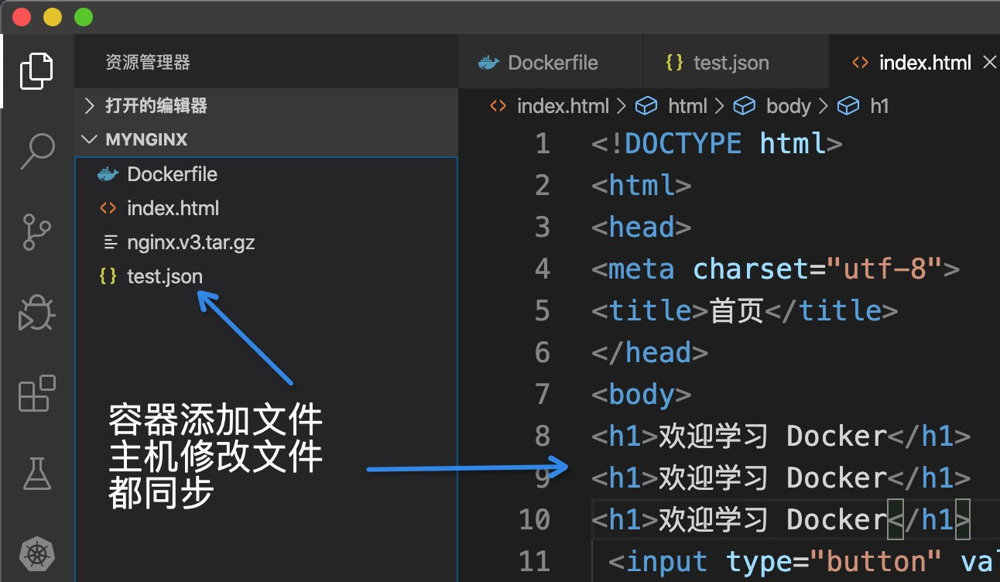

# 6. 数据共享与持久化
这一节介绍如何在 Docker 内部以及容器之间管理数据，在容器中管理数据主要有两种方式：

* 数据卷（Data Volumes）
* 挂载主机目录 (Bind mounts)

## 数据卷
`数据卷`是一个可供一个或多个容器使用的特殊目录，它绕过`UFS`，可以提供很多有用的特性：

* 数据卷 可以在容器之间共享和重用
* 对 数据卷 的修改会立马生效
* 对 数据卷 的更新，不会影响镜像
* 数据卷 默认会一直存在，即使容器被删除

> 注意：数据卷 的使用，类似于 Linux 下对目录或文件进行 mount，镜像中的被指定为挂载点的目录中的文件会隐藏掉，能显示看的是挂载的 数据卷。

选择 -v 还是 -–mount 参数：
Docker 新用户应该选择`--mount`参数，经验丰富的 Docker 使用者对`-v`或者 `--volume`已经很熟悉了，但是推荐使用`--mount`参数。

通过MySQL镜像查看数据卷

```shell
#运行mysql容器
$ docker run -d --name mysql1 -p 3309:3306 -e MYSQL_ALLOW_EMPTY_PASSWORD=true mysql:5.7 
$ docker ps -a #查看运行的容器
$ docker start mysql1 #如果已经有容器，直接启动
$ docker volume ls  #查看docker数据卷      
DRIVER              VOLUME NAME
local               0a2a88a30b289010848b811e4a05480f36bb8c1887198c22333e0cac73e3d59a
local               6b47749be47fef1bf7b04e12b867a1038456f374458ca3e930ef0496d17a8dd4
local               8cdf499c5139226cfd87562ab4640979f5afcd70fe63892534c043fdbe93b72f
------------------------------------------------------------
$ docker inspect mysql1  #查看mysql1的容器信息                                                     
[
    {
        "Id": "1e971421cd89810a7631fe75bf3dc6075e348b2e86ed074a658ea9e8a14ff7f7",
        "Created": "2020-02-26T12:26:33.2469504Z",
        "Path": "docker-entrypoint.sh",
        ...
        "Mounts": [
            {
            "Type": "volume",
            "Name": "6b47749be47fef1bf7b04e12b867a1038456f374458ca3e930ef0496d17a8dd4",#数据卷
            "Source": "/var/lib/docker/volumes/6b47749be47fef1bf7b04e12b867a1038456f374458ca3e930ef0496d17a8dd4/_data",
            "Destination": "/var/lib/mysql",
            "Driver": "local",
            "Mode": "",
            "RW": true,
            "Propagation": ""
            }
        ],
        "Config": {
......
# 可以看到mysql1的数据卷是： "6b47749be47fef1bf7b04e12b867a1038456f374458ca3e930ef0496d17a8dd4"
# 查看该数据卷的信息
$ docker volume inspect 6b47749be47fef1bf7b04e12b867a1038456f374458ca3e930ef0496d17a8dd4                                                                         
[
    {
        "CreatedAt": "2020-03-07T05:13:01Z",
        "Driver": "local",
        "Labels": null,
        "Mountpoint": "/var/lib/docker/volumes/6b47749be47fef1bf7b04e12b867a1038456f374458ca3e930ef0496d17a8dd4/_data",
        "Name": "6b47749be47fef1bf7b04e12b867a1038456f374458ca3e930ef0496d17a8dd4",
        "Options": null,
        "Scope": "local"
    }
]
------------------------------------------------------------
~ » 
```

验证数据卷信息:

```shell
~ » docker exec -it mysql1 /bin/bash              #进入容器                        
root@1e971421cd89:/# mysql -uroot -p123456        #进入mysql
mysql: [Warning] Using a password on the command line interface can be insecure.
Welcome to the MySQL monitor.  Commands end with ; or \g.
Your MySQL connection id is 3
Server version: 5.7.29 MySQL Community Server (GPL)

Copyright (c) 2000, 2020, Oracle and/or its affiliates. All rights reserved.

Oracle is a registered trademark of Oracle Corporation and/or its
affiliates. Other names may be trademarks of their respective
owners.

Type 'help;' or '\h' for help. Type '\c' to clear the current input statement.

mysql> show databases;  #查看数据库
+--------------------+
| Database           |
+--------------------+
| information_schema |
| mysql              |
| performance_schema |
| sys                |
+--------------------+
4 rows in set (0.01 sec)
mysql> create database docker;
Query OK, 1 row affected (0.00 sec)

mysql> show databases;
+--------------------+
| Database           |
+--------------------+
| information_schema |
| docker             |
| mysql              |
| performance_schema |
| sys                |
+--------------------+
5 rows in set (0.00 sec)
mysql> exit  #退出mysql
Bye
root@1e971421cd89:/# exit   #退出容器
exit
------------------------------------------------------------
$ docker ps               #查看运行中的容器                                                                                                                                              kongfanyu@192
CONTAINER ID        IMAGE               COMMAND                  CREATED             STATUS              PORTS                               NAMES
1e971421cd89        mysql:5.7           "docker-entrypoint.s…"   9 days ago          Up 15 minutes       33060/tcp, 0.0.0.0:3309->3306/tcp   mysql1
------------------------------------------------------------
$ docker rm -f mysql1     #强制删除容器                                                                                                                                      kongfanyu@192
mysql1
------------------------------------------------------------
$ docker ps               #查看容器已删除  
CONTAINER ID        IMAGE               COMMAND             CREATED             STATUS              PORTS               NAMES
------------------------------------------------------------
```

重新运行容器:

```shell
$ docker volume ls              #查看数据卷 
DRIVER              VOLUME NAME
local               0a2a88a30b289010848b811e4a05480f36bb8c1887198c22333e0cac73e3d59a
local               6b47749be47fef1bf7b04e12b867a1038456f374458ca3e930ef0496d17a8dd4
local               8cdf499c5139226cfd87562ab4640979f5afcd70fe63892534c043fdbe93b72f
------------------------------------------------------------
#重新运行mysql容器
$ docker run -d --name mysql2 -p 3309:3306 -e MYSQL_ALLOW_EMPTY_PASSWORD=true mysql:5.7  
05876b9b7b081729908f67f51558454cfda8b5edb34ebe8dd49d25ac5388c566
------------------------------------------------------------
#进入mysql2容器
$ docker exec -it mysql2 /bin/bash
root@05876b9b7b08:/# mysql -uroot
Welcome to the MySQL monitor.  Commands end with ; or \g.
Your MySQL connection id is 2
Server version: 5.7.29 MySQL Community Server (GPL)

Copyright (c) 2000, 2020, Oracle and/or its affiliates. All rights reserved.

Oracle is a registered trademark of Oracle Corporation and/or its
affiliates. Other names may be trademarks of their respective
owners.

Type 'help;' or '\h' for help. Type '\c' to clear the current input statement.

mysql> show databases;
+--------------------+
| Database           |
+--------------------+
| information_schema |
| mysql              |
| performance_schema |
| sys                |
+--------------------+
4 rows in set (0.00 sec)
# 可以看出就4个数据库，刚才的容器新建的数据库docker不在了。这是因为重新创建容器docker为mysql重新创建新的数据卷
$ docker volume ls  #可以看到是四个数据卷了；Dockerfile中指定的；如何解决问题？？
DRIVER              VOLUME NAME
local               0a2a88a30b289010848b811e4a05480f36bb8c1887198c22333e0cac73e3d59a
local               6b47749be47fef1bf7b04e12b867a1038456f374458ca3e930ef0496d17a8dd4
local               8cdf499c5139226cfd87562ab4640979f5afcd70fe63892534c043fdbe93b72f
local               28f17b8de349f66567666cb698ca7f7484d695e2381ae23b1752a07fc9b2f50a
# 在启动容器的时候指定挂载的数据卷，这时候会新创建一个数据卷，以后每次运行都指定该数据卷；数据就会恢复。
```

启动容器指定数据卷

```shell
$ docker rm -f mysql2            #强制删除mysql2容器
mysql2
------------------------------------------------------------
#运行mysql容器指定数据卷mysql
$ docker run -d --name mysql_fuzi -v mysql:/var/lib/mysql -e MYSQL_ALLOW_EMPTY_PASSWORD=true mysql:5.7    
6d741a76977152a02380de0fd7c19de37e4e563813708ea6f0b946189575e2ff
------------------------------------------------------------
$ docker ps                  #查看当前运行的容器
CONTAINER ID        IMAGE               COMMAND                  CREATED             STATUS              PORTS                 NAMES
6d741a769771        mysql:5.7           "docker-entrypoint.s…"   11 seconds ago      Up 11 seconds       3306/tcp, 33060/tcp   mysql_fuzi
------------------------------------------------------------
$ docker volume ls            #docker数据卷，可以看到新增加一个数据卷mysql
DRIVER              VOLUME NAME
local               0a2a88a30b289010848b811e4a05480f36bb8c1887198c22333e0cac73e3d59a
local               6b47749be47fef1bf7b04e12b867a1038456f374458ca3e930ef0496d17a8dd4
local               8cdf499c5139226cfd87562ab4640979f5afcd70fe63892534c043fdbe93b72f
local               28f17b8de349f66567666cb698ca7f7484d695e2381ae23b1752a07fc9b2f50a
local               mysql
------------------------------------------------------------
$ docker inspect volume mysql           #查看mysql数据卷
[
    {
        "CreatedAt": "2020-03-07T12:37:27Z",
        "Driver": "local",
        "Labels": null,
        "Mountpoint": "/var/lib/docker/volumes/mysql/_data",
        "Name": "mysql",
        "Options": null,
        "Scope": "local"
    }
]
Error: No such object: volume
------------------------------------------------------------
```

删除容器

```shell
~ » docker exec -it mysql_fuzi /bin/bash              #进入容器
root@6d741a769771:/# mysql -uroot                     #登录mysql
Welcome to the MySQL monitor.  Commands end with ; or \g.
Your MySQL connection id is 2
Server version: 5.7.29 MySQL Community Server (GPL)

Copyright (c) 2000, 2020, Oracle and/or its affiliates. All rights reserved.

Oracle is a registered trademark of Oracle Corporation and/or its
affiliates. Other names may be trademarks of their respective
owners.

Type 'help;' or '\h' for help. Type '\c' to clear the current input statement.

mysql> show databases; #查看数据库
+--------------------+
| Database           |
+--------------------+
| information_schema |
| mysql              |
| performance_schema |
| sys                |
+--------------------+
4 rows in set (0.00 sec)

mysql> create database docker;#创建数据库
Query OK, 1 row affected (0.00 sec)

mysql> show databases;  #查看数据库
+--------------------+
| Database           |
+--------------------+
| information_schema |
| docker             |
| mysql              |
| performance_schema |
| sys                |
+--------------------+
5 rows in set (0.00 sec)

mysql> exit #退出mysql数据库
Bye
root@6d741a769771:/# exit    #退出容器
exit
------------------------------------------------------------
~ »                   
```

运行容器指定数据卷

```shell
~ » docker rm -f mysql_fuzi     #删除容器
mysql_fuzi
------------------------------------------------------------
~ » docker volume ls            #查看数据卷
DRIVER              VOLUME NAME
local               0a2a88a30b289010848b811e4a05480f36bb8c1887198c22333e0cac73e3d59a
local               6b47749be47fef1bf7b04e12b867a1038456f374458ca3e930ef0496d17a8dd4
local               8cdf499c5139226cfd87562ab4640979f5afcd70fe63892534c043fdbe93b72f
local               28f17b8de349f66567666cb698ca7f7484d695e2381ae23b1752a07fc9b2f50a
local               mysql
------------------------------------------------------------
~ » docker run -d --name mysql_kong -v mysql:/var/lib/mysql -e MYSQL_ALLOW_EMPTY_PASSWORD=true mysql:5.7  #重新运行容器
0ea8163e55303d46eb360150f5befba50ac8bba07050aa2ad51caed5527d99d2
------------------------------------------------------------
~ » docker exec -it mysql_kong /bin/bash         #进入容器                                                                                        kongfanyu@kongfanyudeMacBook-Pro
root@0ea8163e5530:/# mysql -uroot                #进入数据库
Welcome to the MySQL monitor.  Commands end with ; or \g.
Your MySQL connection id is 2
Server version: 5.7.29 MySQL Community Server (GPL)

Copyright (c) 2000, 2020, Oracle and/or its affiliates. All rights reserved.

Oracle is a registered trademark of Oracle Corporation and/or its
affiliates. Other names may be trademarks of their respective
owners.

Type 'help;' or '\h' for help. Type '\c' to clear the current input statement.

mysql> show databases;  #查看数据库，docker还在
+--------------------+
| Database           |
+--------------------+
| information_schema |
| docker             |
| mysql              |
| performance_schema |
| sys                |
+--------------------+
5 rows in set (0.00 sec)

mysql> exit
Bye
root@0ea8163e5530:/# exit
exit
------------------------------------------------------------
~ »        
```

删除数据卷

```shell
~ » docker rm -f mysql_kong  #删除容器
mysql_kong
------------------------------------------------------------
~ » docker volume rm mysql  #删除数据卷
mysql
------------------------------------------------------------
~ » docker volume prune     #删除所有数据卷，注意命令慎重
WARNING! This will remove all local volumes not used by at least one container.
Are you sure you want to continue? [y/N] y
Deleted Volumes:
0a2a88a30b289010848b811e4a05480f36bb8c1887198c22333e0cac73e3d59a
6b47749be47fef1bf7b04e12b867a1038456f374458ca3e930ef0496d17a8dd4
8cdf499c5139226cfd87562ab4640979f5afcd70fe63892534c043fdbe93b72f
28f17b8de349f66567666cb698ca7f7484d695e2381ae23b1752a07fc9b2f50a

Total reclaimed space: 489.9MB  #释放空间
------------------------------------------------------------
~ » docker volume ls            #查看所有的数据卷
DRIVER              VOLUME NAME
------------------------------------------------------------
```


创建一个数据卷：
```shell
$ docker volume create my-vol
```

查看所有的 数据卷：
```shell
$ docker volume ls
local               my-vol
```

在主机里使用以下命令可以查看指定 数据卷 的信息
```shell
$ docker volume inspect my-vol
[
    {
        "Driver": "local",
        "Labels": {},
        "Mountpoint": "/var/lib/docker/volumes/my-vol/_data",
        "Name": "my-vol",
        "Options": {},
        "Scope": "local"
    }
]
```

启动一个挂载数据卷的容器：在用`docker run`命令的时候，使用`--mount`标记来将 数据卷 挂载到容器里。在一次`docker run`中可以挂载多个 数据卷。下面创建一个名为 web 的容器，并加载一个 数据卷 到容器的 /webapp 目录。
```shell
$ docker run -d -P \
    --name web \
    # -v my-vol:/wepapp \
    --mount source=my-vol,target=/webapp \
    training/webapp \
    python app.py
```

查看数据卷的具体信息：在主机里使用以下命令可以查看 web 容器的信息
```shell
$ docker inspect web
...
"Mounts": [
    {
        "Type": "volume",
        "Name": "my-vol",
        "Source": "/var/lib/docker/volumes/my-vol/_data",
        "Destination": "/app",
        "Driver": "local",
        "Mode": "",
        "RW": true,
        "Propagation": ""
    }
],
...
```

删除数据卷：
```
$ docker volume rm my-vol
```

数据卷 是被设计用来持久化数据的，它的生命周期独立于容器，Docker 不会在容器被删除后自动删除 数据卷，并且也不存在垃圾回收这样的机制来处理没有任何容器引用的 数据卷。如果需要在删除容器的同时移除数据卷。可以在删除容器的时候使用`docker rm -v`这个命令。
无主的数据卷可能会占据很多空间，要清理请使用以下命令
```
$ docker volume prune
```


## 构建镜像

```shell
~/Documents/Docker&K8S » cd mynginx   #到指定目录
------------------------------------------------------------
~/Documents/Docker&K8S/mynginx » ll  #查看目录
total 96400
-rw-r--r--@ 1 kongfanyu  staff   142B  3  7 21:39 Dockerfile
-rw-r--r--@ 1 kongfanyu  staff   930B  2  8 16:56 index.html   #注意添加index.html文件
-rw-r--r--@ 1 kongfanyu  staff    47M  2 24 19:23 nginx.v3.tar.gz
------------------------------------------------------------
~/Documents/Docker&K8S/mynginx » docker build -t nginx:v4 .    #基于Nginx构建镜像
Sending build context to Docker daemon   49.2MB
Step 1/3 : FROM nginx
latest: Pulling from library/nginx
68ced04f60ab: Already exists 
28252775b295: Pull complete 
a616aa3b0bf2: Pull complete 
Digest: sha256:2539d4344dd18e1df02be842ffc435f8e1f699cfc55516e2cf2cb16b7a9aea0b
Status: Downloaded newer image for nginx:latest
 ---> 6678c7c2e56c
Step 2/3 : WORKDIR /usr/share/nginx/html
 ---> Running in 00182e6660cc
Removing intermediate container 00182e6660cc
 ---> d88871cfccaa
Step 3/3 : COPY index.html index.html
 ---> bba7329543a3
Successfully built bba7329543a3
Successfully tagged nginx:v4
------------------------------------------------------------
~/Documents/Docker&K8S/mynginx » docker images    #查看构建结果
REPOSITORY                 TAG                 IMAGE ID            CREATED              SIZE
nginx                      v4                  bba7329543a3        About a minute ago   127MB
nginx                      latest              6678c7c2e56c        2 days ago           127MB
192.168.0.108:5000/nginx   v3                  a1523e859360        9 days ago           127MB
ubuntu                     16.04               77be327e4b63        2 weeks ago          124MB
mysql                      5.7                 d5cea958d330        2 weeks ago          440MB
registry                   2.6.2               10b45af23ff3        6 weeks ago          28.5MB
busybox                    latest              6d5fcfe5ff17        2 months ago         1.22MB
------------------------------------------------------------
~/Documents/Docker&K8S/mynginx » docker run -d --name mynginx -p 8084:80 nginx:v4 #运行镜像
4e0b9e3b11204b8258473d3a6aafd4c37d19cf164f91078d6baf984b83bcb9ee
------------------------------------------------------------
~/Documents/Docker&K8S/mynginx » docker ps      #查看容器
CONTAINER ID        IMAGE               COMMAND                  CREATED             STATUS              PORTS                  NAMES
4e0b9e3b1120        nginx:v4            "nginx -g 'daemon of…"   4 seconds ago       Up 3 seconds        0.0.0.0:8084->80/tcp   mynginx
------------------------------------------------------------
~/Documents/Docker&K8S/mynginx » 
```

访问nginx服务:


## 挂载主机目录

```shell
$ docker rm -f mynginx     #删除镜像
mynginx
------------------------------------------------------------
#运行容器通过 -v参数挂载主机目录
$ docker run -d --name mynginx -p 8084:80 -v $(pwd):/usr/share/nginx/html nginx:v4
a7902b2347f592bb4958de3213929271c191efbb1475cf0f86ce8a26e626ebcd
------------------------------------------------------------
$ docker ps                                                                                               kongfanyu@kongfanyudeMacBook-Pro
CONTAINER ID        IMAGE               COMMAND                  CREATED             STATUS              PORTS                  NAMES
a7902b2347f5        nginx:v4            "nginx -g 'daemon of…"   9 seconds ago       Up 3 seconds        0.0.0.0:8084->80/tcp   mynginx
------------------------------------------------------------
$ docker exec -it mynginx /bin/bash    #进入容器
root@a7902b2347f5:/usr/share/nginx/html# ls
Dockerfile  index.html	nginx.v3.tar.gz
root@a7902b2347f5:/usr/share/nginx/html# touch test.json  #添加一个文件
root@a7902b2347f5:/usr/share/nginx/html# cat test.json
{
    "test":100
}root@a7902b2347f5:/usr/share/nginx/html#
```

这时主机目录就多一个文件:


查看镜像文件信息:

```shell
$ docker inspect mynginx                                                                                  kongfanyu@kongfanyudeMa
......
        "Mounts": [
            {
                "Type": "bind",  #绑定
                "Source": "/Users/kongfanyu/Documents/Docker&K8S/mynginx",#主机目录
                "Destination": "/usr/share/nginx/html",#挂载目标目录
                "Mode": "",
                "RW": true,
                "Propagation": "rprivate"
            }
        ]
......
```


========================================================================================================================================================================================================================================================================================================================================================================================================================

选择 -v 还是 -–mount 参数：
Docker 新用户应该选择 --mount 参数，经验丰富的 Docker 使用者对 -v 或者 --volume 已经很熟悉了，但是推荐使用 --mount 参数。

挂载一个主机目录作为数据卷：使用 `--mount` 标记可以指定挂载一个本地主机的目录到容器中去。
```shell
$ docker run -d -P \
    --name web \
    # -v /src/webapp:/opt/webapp \
    --mount type=bind,source=/src/webapp,target=/opt/webapp \
    training/webapp \
    python app.py
```
上面的命令加载主机的 /src/webapp 目录到容器的 /opt/webapp目录。这个功能在进行测试的时候十分方便，比如用户可以放置一些程序到本地目录中，来查看容器是否正常工作。本地目录的路径必须是绝对路径，以前使用 -v 参数时如果本地目录不存在 Docker 会自动为你创建一个文件夹，现在使用 --mount 参数时如果本地目录不存在，Docker 会报错。

Docker 挂载主机目录的默认权限是 读写，用户也可以通过增加`readonly`指定为 只读。
```shell
$ docker run -d -P \
    --name web \
    # -v /src/webapp:/opt/webapp:ro \
    --mount type=bind,source=/src/webapp,target=/opt/webapp,readonly \
    training/webapp \
    python app.py
```

加了`readonly`之后，就挂载为 只读 了。如果你在容器内 /opt/webapp 目录新建文件，会显示如下错误:
```shell
/opt/webapp # touch new.txt
touch: new.txt: Read-only file system
```

查看数据卷的具体信息：在主机里使用以下命令可以查看 web 容器的信息
```shell
$ docker inspect web
...
"Mounts": [
    {
        "Type": "bind",
        "Source": "/src/webapp",
        "Destination": "/opt/webapp",
        "Mode": "",
        "RW": true,
        "Propagation": "rprivate"
    }
],
```

挂载一个本地主机文件作为数据卷：`--mount`标记也可以从主机挂载单个文件到容器中
```shell
$ docker run --rm -it \
   # -v $HOME/.bash_history:/root/.bash_history \
   --mount type=bind,source=$HOME/.bash_history,target=/root/.bash_history \
   ubuntu:17.10 \
   bash

root@2affd44b4667:/# history
1  ls
2  diskutil list
```

这样就可以记录在容器输入过的命令了。
